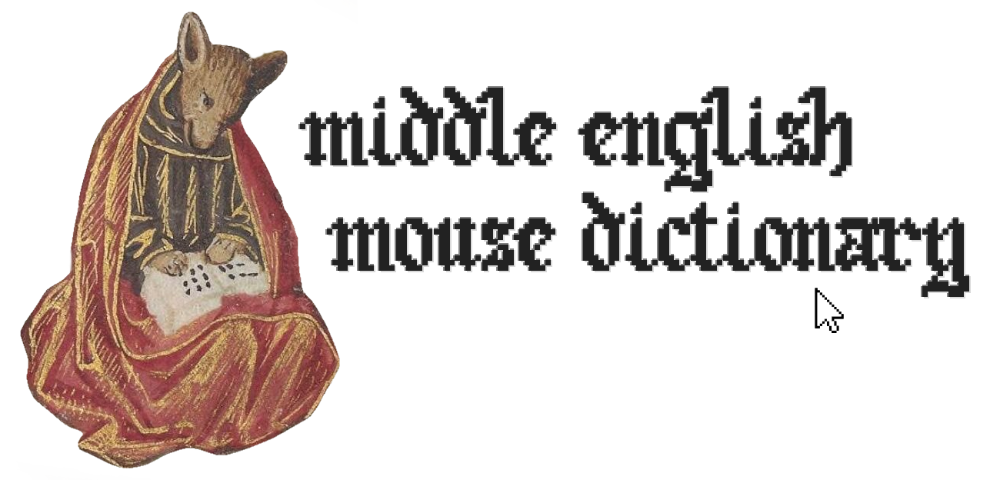
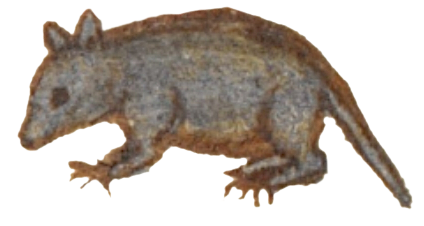

  
# Middle English Mouse Dictionary  

The Middle English Mouse Dictionary is a browser extension (Firefox, Chrome) that helps you to read middle english web pages by showing information about a word when you double click it.

## How it works  
When you double-click/tap a word in a webpage, your browser highlights that word and temporarily saves it in your browser's local data storage. When this happens our script extracts that word and checks a dictionary file that comes with this extension.  
  
If the word you doubleclicked is in the dictionary, a small popup will appear next to your mouse with information about the word.  
  
## Places you can test this

- The largest unannotated text resource, and one for which this extension is most suited, is the University of Michigan's [Corpus of Middle English Prose and Verse](https://quod.lib.umich.edu/c/cme/).
- Centre for Medieval and Early Modern Studies, University of Kent's [MEMSlib](https://www.memslib.co.uk/middle-english-texts) contains many digitizations.
- Harvard's [Geoffery Chaucer Website](https://chaucer.fas.harvard.edu/pages/john-gower-1325-1403).
- The International John Gower Society's [Original Language Editions](https://johngower.org/online-editions/).
- You might check an old cookbook like [The Forme of Cury](https://www.gutenberg.org/cache/epub/8102/pg8102.txt), as edited by Samuel Pegge.

## Motivation & Ethos
We wish to facilitate the enjoyment and study of historical texts, for enthusiasts and professionals alike. We sought to make a lookup tool that would only require access to a digitized text from an original manuscript.  
   
We have coded this extension to be as simple as possible, avoiding using unnecessary frameworks and dependencies. This software is fully open-source and will continue as such in perpetuum. 

  
## Acknowledgements
- Dictionary: an error-corrected digitzation of J.R.R. Tolkien's "[A Middle English Vocabulary](https://github.com/digitaltolkien/a-middle-english-vocabulary)" dictionary, provided by [James K. Tauber](https://github.com/jtauber) of the [Digital Tolkien Project](https://digitaltolkien.com). 
- Dictionary: a digitization of A. L. Mayhew and Walter W. Skeat's "[A Concise Dictionary of Middle English
       From A.D. 1150 To 1580](https://github.com/GITenberg/A-Concise-Dictionary-of-Middle-EnglishFrom-A.D.-1150-to-1580_10625/tree/master)", hosted by [GiTenberg](https://www.gitenberg.org).
- Logo: the font in the logo is "[Old English Gothic Pixel Font](https://www.fontspace.com/old-english-gothic-pixel-font-f83405)", designed by [ColorSwitchFan25](https://www.fontspace.com/colorswitchfan25) and used under the SIL Open Font License (OFL)

