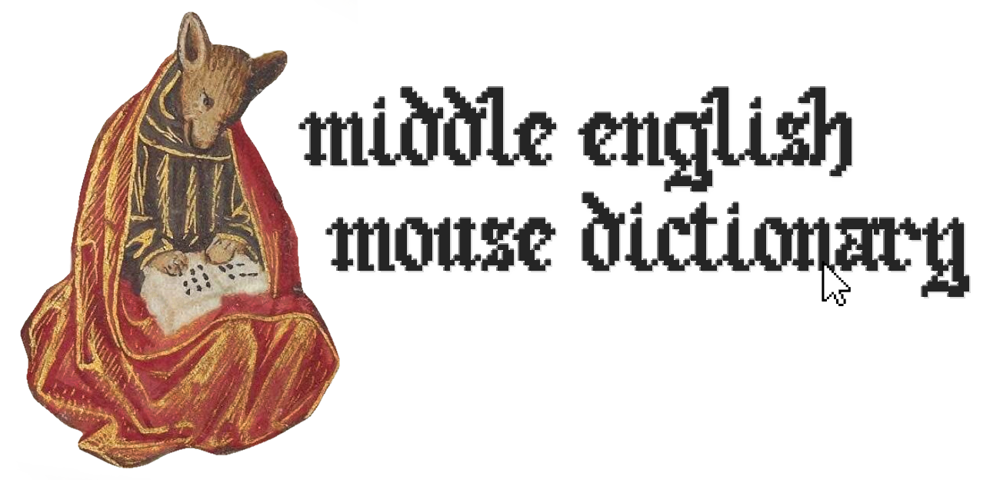

  
# Middle English Mouse Dictionary  

The Middle English Mouse Dictionary is a prototype browser extension for [Firefox](https://www.mozilla.org/firefox/) that assists in reading middle english web pages by showing dictionary information about middle english words when they are highlighted or double-clicked. It tracks which words you add to your personal word list for each tab, and displays them in a sidebar.

Install the extension [here](https://addons.mozilla.org/en-GB/firefox/addon/memd/).  

## Roadmap

At present this is a prototype, written in pure JS to be as simple as possible. 
In time we intend to: 
- Add additional dictionaries.
- Implement fuzzy matching to combat orthographic complexity
- Improve the UI and UX
- Adapt for Chrome/Safari and Manifest V3
- Move over to a framework if we deem it suitable
- Get funding and/or support from institutions

## Places you can test this

- Try reading [Gawain and the Green Knight](https://rpo.library.utoronto.ca/content/sir-gawain-and-green-knight).
- The University of Michigan's [Corpus of Middle English Prose and Verse](https://quod.lib.umich.edu/c/cme/).
- Centre for Medieval and Early Modern Studies, University of Kent's [MEMSlib](https://www.memslib.co.uk/middle-english-texts).
- Harvard's [Geoffery Chaucer Website](https://chaucer.fas.harvard.edu/pages/john-gower-1325-1403).
- The International John Gower Society's [Original Language Editions](https://johngower.org/online-editions/).

  
## Acknowledgements
- Dictionary: an error-corrected digitzation of J.R.R. Tolkien's "[A Middle English Vocabulary](https://github.com/digitaltolkien/a-middle-english-vocabulary)" dictionary, provided by [James K. Tauber](https://github.com/jtauber) of the [Digital Tolkien Project](https://digitaltolkien.com). 
- Dictionary: a digitization of A. L. Mayhew and Walter W. Skeat's "[A Concise Dictionary of Middle English
       From A.D. 1150 To 1580](https://github.com/GITenberg/A-Concise-Dictionary-of-Middle-EnglishFrom-A.D.-1150-to-1580_10625/tree/master)", hosted by [GiTenberg](https://www.gitenberg.org).
- Logo: the font in the logo is "[Old English Gothic Pixel Font](https://www.fontspace.com/old-english-gothic-pixel-font-f83405)", designed by [ColorSwitchFan25](https://www.fontspace.com/colorswitchfan25) and used under the SIL Open Font License (OFL)

